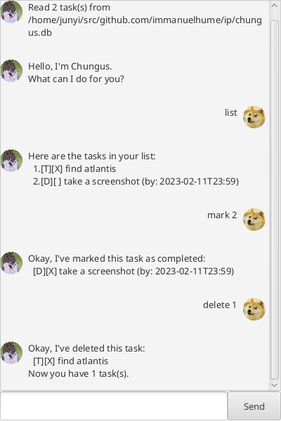

# User Guide

_Chungus_ is a demo application built for a university software engineering class, based on the [AB3](https://github.com/se-edu/addressbook-level3) template.

## Features

- **Persistence**: Chungus will save your tasks to disk
- **Text-based**: All interactions are through text commands
- **Cross-platform**: Thanks to groundbreaking Java 'write once, run anywhere' technology
- **Tags**: Chungus supports tagging tasks as an alternative way of categorization

## Usage

### `list` - Lists available tasks

Example of usage:

`list`

Expected outcome:

All tasks previously created and not deleted are listed in order of creation.

### `todo` - Create a todo

A todo is the simplest type of task, with no associated datetime.

Example of usage:

`todo find atlantis`

Expected outcome:

A new task with the description "find atlantis" is created.

### `deadline` - Create a task with deadline

A deadline can be associated to a task. The date and time must be in `dd/MM/yyyy HHmm` format.

Example of usage:

`deadline write a user guide /by 11/02/2023 2359`

Expected outcome:

A new task with the description "write a user guide" is created, with the associated deadline of 2nd February 2023, 11:59pm.

### `event` - Create an event

An event is a type of task with a specified start and end time. The date and time must be in `dd/MM/yyyy hhmm` format.

Example of usage:

`event gotoubun movie preview /from 12/10/2022 1500 /to 12/10/2022 1700`

Expected outcome:

A new event with the description "gotoubun movie preview" is created, with the associated duration of 12th October 2022 3:00pm to 5:00pm.

### `mark` - Complete a task

To select a task to complete, first use `list` to see its current index. Then proceed to mark the task, as per the example below.

Example of usage:

`mark 1`

Expected outcome:

The task with index 1 is marked as completed.

### `unmark` - Reverse completion

This is the reverse of `mark`.

Example of usage:

`unmark 1`

Expected outcome:

The task with index 1 is marked as incomplete.

### `delete` - Delete a task

As with `mark`, a task can be selected using its index, which is checked by first using `list`. Note that deletion is not reversible.

Example of usage:

`delete 1`

Expected outcome:

The task with index 1 is deleted.

### `find` - Find a task

A simple keyword search which finds all tasks with descriptions containing the exact phrase provided.

Example of usage:

`find date`

Expected outcome:

All tasks with the word "date" in its description are listed.

### `tag` - Tag a task

A task can have any number of tags. A tag must be a single token, i.e. a tag like `won't fix` is not supported.

Example of usage:

`tag 1 work urgent`

Expected outcome:

The task at index 1 is tagged with `work` and `urgent`.

### `tagall` - Match tasks by tag

Finds all tasks which have at least _all_ the tags provided.

Example of usage:

`tagall work urgent`

Expected outcome:

All tasks which were previously tagged with `work` and `urgent` are listed.

### `tagany` - Match tasks by tag

Finds all tasks which have at least _one of_ the tags provided.

Example of usage:

`tagany work urgent`

Expected outcome:

All tasks which were previously tagged with `work` or `urgent` are listed.

### `tagsee` - Inspect tags

For a given task, see what tags it has. The task is selected by its index from running the `list` command.

Example of usage:

`tagsee 1`

Expected outcome:

The tags associated with task 1 are listed.
